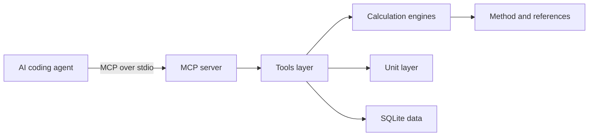

# Engineer MCP

[](https://github.com/DanielCuevas1208/engineer-mcp/actions/workflows/ci.yml)
[](LICENSE)
[](https://www.typescriptlang.org/)
[](package.json)

Engineer MCP is a Model Context Protocol server for mechanical-engineering calculations.
It gives coding agents verified answers for beams, bolts, springs, shafts, bearings, stress, fatigue, sections, and units.
Every result shows the formula, the method, and the source.

## What it provides

Use Engineer MCP inside an AI coding agent.
The agent calls a tool and receives a complete engineering answer.
The answer includes numbers, units, assumptions, and citations.

The release covers these domains:

- Beam bending stress and deflection.
- Bolt tensile design to ISO 898.
- Helical compression spring design.
- Shaft torsion and first critical speed.
- Bearing rating life to ISO 281.
- von Mises equivalent stress.
- Fatigue safety factors for cyclic loads.
- Cross-section properties.
- Dimension-safe unit conversion.
- Material property lookup.

## How results stay trustworthy

Each result carries its provenance.
The envelope lists the method, the formula, and the notes.
It also lists the cited standards and texts.

Units are checked at every step.
The unit layer knows the dimension of every unit.
It rejects a conversion between incompatible quantities.
For example, it rejects a torque-to-energy conversion.

Safety factors appear only when you provide a yield strength.
The tool never hides an assumption.
Warnings surface when a method uses an approximation.

## Tools

| Tool | What it does |
| --- | --- |
| `beam_bending` | Bending stress, deflection, and safety factor. |
| `section_properties` | Area, inertia, and section modulus of a shape. |
| `bolt_strength` | Stress area, preload, and capacity of a bolt. |
| `spring_design` | Spring rate, shear stress, and safety factor of a compression spring. |
| `shaft_analysis` | Torsion stress, twist, and critical speed. |
| `bearing_life` | ISO 281 rating life in revolutions and hours. |
| `von_mises` | Equivalent stress and yield safety factor. |
| `fatigue_analysis` | Fatigue safety factors for cyclic loads. |
| `unit_convert` | Conversion between compatible units. |
| `material_lookup` | Curated mechanical properties of materials. |

See [docs/mcp-tools.md](docs/mcp-tools.md) for the full reference.

## Architecture

Engineer MCP keeps the math separate from the server.
Pure engine functions take SI numbers and return plain objects.
The server layer adds unit conversion, material lookup, and provenance.
The database seeds from JSON files on first start.



Key directories:

| Path | Role |
| --- | --- |
| `src/engine/` | Pure calculation functions. |
| `src/units/` | Dimension-safe unit conversion. |
| `src/db/` | SQLite schema and seeding. |
| `src/handlers.ts` | Tool orchestration and result envelopes. |
| `data/` | Material, fastener, and reference data. |

## Quick start

1. Install Node.js 22.13 or newer.
2. Clone or copy this repository to your machine.
3. Run `npm install` to install dependencies.
4. Run `npm run build` to compile the server.
5. Run `npm run demo` to see the demo output.

The demo prints results for every tool.
It runs against an in-memory database.
It needs no API keys and no network access.

## Run as an MCP server

Run the server over standard input and output.

```sh
node dist/index.js
```

Add it to your MCP client configuration.
See [examples/mcp-config.example.json](examples/mcp-config.example.json) for a template.
Set `ENGINEER_MCP_DB` or pass `--db <path>` to choose the database file.
The default database file is `engineer-mcp.sqlite` in the working directory.

## Sample output

A call to `beam_bending` with a 20 kN point load on a 3 m S355 I-beam:

```text
Maximum bending moment                  15 kN·m
Maximum bending stress               25.36 MPa
Maximum deflection                  0.6039 mm
Bending safety factor                    14

Method: Euler-Bernoulli beam theory
Formula: simply supported, point: M = FL/4, delta = FL^3/(48EI)
References:
  - Roark's Formulas for Stress and Strain (Eighth edition, 2011)
  - Mechanics of Materials (Euler-Bernoulli beam theory)
```

A call to `spring_design` for a steel spring under 2 kN with squared and ground ends:

```text
Spring index                              5
Wahl factor                            1.31
Total coils                               6
Solid height                             48 mm
Spring rate                           158.6 N/mm
Deflection at load                    12.61 mm
Working length                        77.39 mm
Maximum shear stress                  521.4 MPa
Spring safety factor                  1.342

Method: Helical compression spring design
Formula: C = D/d, K_w = (4C-1)/(4C-4) + 0.615/C, tau = K_w 8FD/(pi d^3), k = G d^4/(8 D^3 Na), delta = F/k, Ls = d Nt
References:
  - Shigley's Mechanical Engineering Design (Tenth edition, 2015)
  - Machinery's Handbook (Thirty-first edition)
```

A call to `unit_convert` with a torque-to-energy request fails safely:

```text
Error: Category mismatch: N·m is torque, J is energy.
Use a unit of the same quantity.
```

A call to `fatigue_analysis` for a steel part under 400 MPa mean stress and 200 MPa alternating stress:

```text
Mean stress                             400 MPa
Alternating stress                      200 MPa
Stress ratio                             0.3333
Endurance limit                         500 MPa
Soderberg safety factor                  1.218
Goodman safety factor                    1.364
Gerber safety factor                     1.699
ASME-elliptic safety factor               1.722

Soderberg safety factor                  1.218
  Factor for the Soderberg line from Se to Sy. It is the most conservative criterion.

Method: Fatigue failure criteria for fluctuating stress
Formula: Soderberg: sa/Se + sm/Sy = 1/n. Goodman: sa/Se + sm/Sut = 1/n. Gerber: n.sa/Se + (n.sm/Sut)^2 = 1. ASME-elliptic: (n.sa/Se)^2 + (n.sm/Sy)^2 = 1
References:
  - Shigley's Mechanical Engineering Design (McGraw-Hill Education, Tenth edition, 2015)
```

The tool always returns all four safety factors. It warns when a factor falls below 1.

## Development

| Command | Purpose |
| --- | --- |
| `npm run typecheck` | Run the TypeScript compiler. |
| `npm test` | Run the deterministic test suite. |
| `npm run build` | Emit `dist/` from `src/`. |
| `npm run demo` | Run the end-to-end demo. |
| `npm run dev` | Start the server from source. |

## Test status

The test suite is deterministic and offline.
It covers the engines, the unit layer, the database, and the tools.

- 115 tests across 11 files.
- All tests pass on Node 22 and Node 24.
- The CI workflow runs typecheck, tests, build, demo, and a package check.

Run `npm test` to reproduce the results.

## Limitations

- The beam theory applies to small elastic deflections.
- The material table covers common engineering grades only.
- The bolt tables cover coarse metric threads from M5 to M36.
- The bearing factors are typical values for deep-groove ball bearings.
- The critical speed is a first-mode approximation.
- The spring design covers static round-wire springs only.
  Use the `fatigue_analysis` tool for cyclic loads.
- The fatigue criteria assume a tensile mean stress.
  The endurance limit defaults to `0.5 x Sut`.
  Apply modifying factors for surface, size, load, temperature, and reliability.
- The built-in SQLite module of Node.js is still experimental.

Check the cited sources for exact values.

## Roadmap

The server grows in independent releases.
Each release stays useful on its own.

### Complete

- Helical compression spring design.
  The `spring_design` tool reports the spring rate, the shear stress, and the safety factor.
- Fatigue analysis for cyclic loads.
  The `fatigue_analysis` tool returns safety factors for the Soderberg, Goodman, Gerber, and ASME-elliptic criteria.

### Remaining

- Add press-fit and interference-fit calculators.
- Add more unit categories, including viscosity and thermal conductivity.
- Add HTTP transport.
- Add a catalog of ISO and DIN standard sections.

See [docs/integration.md](docs/integration.md) for the EngineerKit plan.

## EngineerKit

Engineer MCP is part of the EngineerKit family.
The family shares conventions for calculations, units, and provenance.
Other EngineerKit servers can import `@engineerkit/engineer-mcp/engine` and `@engineerkit/engineer-mcp/units`.
Read the boundary rules in [docs/integration.md](docs/integration.md).

## License

MIT. See [LICENSE](LICENSE).
