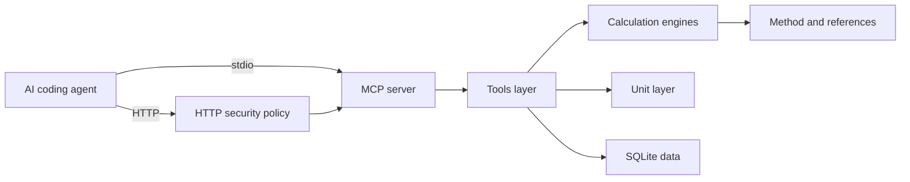

# Engineer MCP

[](https://github.com/DanielCuevas1208/engineer-mcp/actions/workflows/ci.yml)
[](LICENSE)
[](https://www.typescriptlang.org/)
[](package.json)

Engineer MCP is a Model Context Protocol server for mechanical-engineering calculations.
It gives coding agents verified answers for beams, bolts, springs, shafts, bearings, stress, sections, fits, and units.
Every result shows the formula, the method, and the source.

## What it provides
Use Engineer MCP inside an AI coding agent.
The agent calls a tool and receives a complete engineering answer.
The answer includes numbers, units, assumptions, and citations.

The release covers these domains:

- Beam bending stress and deflection.
- Bolt tensile design to ISO 898.
- Helical compression spring design.
- Shaft torsion and first critical speed.
- Bearing rating life to ISO 281.
- von Mises equivalent stress.
- Fatigue analysis for cyclic loads.
- Cross-section properties.
- Press and shrink fit analysis by Lamé theory.
- Standard steel section catalog to EN 10365.
  The catalog returns the separate source for published section properties.
- Bearer authentication and browser origin allow-lists for HTTP clients.
- Dimension-safe unit conversion, including viscosity and thermal conductivity.
- Material property lookup.
- Stdio and HTTP transports.
  The HTTP mode serves the same tools over the Streamable HTTP protocol.

## How results stay trustworthy

Each result carries its provenance.
The envelope lists the method, the formula, and the notes.
It also lists the cited standards and texts.

Units are checked at every step.
The unit layer knows the dimension of every unit.
It rejects a conversion between incompatible quantities.
For example, it rejects a torque-to-energy conversion.

Safety factors appear only when you provide the data they need.
The tool never hides an assumption.
Warnings surface when a method uses an approximation.

## Tools

| Tool | What it does |
| --- | --- |
| `beam_bending` | Bending stress, deflection, and safety factor. |
| `section_properties` | Area, inertia, and section modulus of a shape. |
| `bolt_strength` | Stress area, preload, and capacity of a bolt. |
| `interference_fit` | Interface pressure, hoop stresses, and friction capacity of a press or shrink fit. |
| `spring_design` | Spring rate, shear stress, and safety factor of a compression spring. |
| `shaft_analysis` | Torsion stress, twist, and critical speed. |
| `bearing_life` | ISO 281 rating life in revolutions and hours. |
| `von_mises` | Equivalent stress and yield safety factor. |
| `fatigue_analysis` | Endurance limit and fatigue safety factor for cyclic loads. |
| `unit_convert` | Conversion between compatible units. |
| `material_lookup` | Curated mechanical properties of materials. |
| `section_catalog` | Published IPE, HEA, HEB, and UPN steel sections. |

See [docs/mcp-tools.md](docs/mcp-tools.md) for the full reference.
See [docs/section-catalog.md](docs/section-catalog.md) for the covered range, the value provenance, and the data audit.
See [docs/units.md](docs/units.md) for the unit model and the full category list.
See [docs/transport.md](docs/transport.md) for the HTTP transport reference.

## Architecture

Engineer MCP keeps the math separate from the server.
Pure engine functions take SI numbers and return plain objects.
The server layer adds unit conversion, material lookup, and provenance.
The database seeds from JSON files on first start.



Key directories:

| Path | Role |
| --- | --- |
| `src/engine/` | Pure calculation functions. |
| `src/units/` | Dimension-safe unit conversion. |
| `src/db/` | SQLite schema and seeding. |
| `src/handlers.ts` | Tool orchestration and result envelopes. |
| `src/http.ts` | Streamable HTTP transport and session registry. |
| `src/http-security.ts` | Bearer authentication and browser-origin policy. |
| `src/index.ts` | CLI entry point and transport selection. |
| `data/` | Material, fastener, section, and reference data. |

## Quick start

1. Install Node.js 22.13 or newer.
2. Clone or copy this repository to your machine.
3. Run `npm install` to install dependencies.
4. Run `npm run build` to compile the server.
5. Run `npm run demo` to see the demo output.

The demo prints results for every tool.
It runs against an in-memory database.
It needs no API keys and no network access.

Configure HTTP authentication with `ENGINEER_MCP_AUTH_TOKEN`.
Configure browser access with `ENGINEER_MCP_ALLOWED_ORIGINS`.

## Run as an MCP server

Run the server over standard input and output.

```sh
node dist/index.js
```

Add it to your MCP client configuration.
See [examples/mcp-config.example.json](examples/mcp-config.example.json) for a template.
Set `ENGINEER_MCP_DB` or pass `--db <path>` to choose the database file.
The default database file is `engineer-mcp.sqlite` in the working directory.

## Run over HTTP

Run the server with the HTTP transport.

```sh
node dist/index.js --transport http
```

The server listens on `http://127.0.0.1:3000/mcp`.
Set `--host` and `--port` to change the bind address.
Set `--response-mode sse` when the client requires Server-Sent Events.
The default response mode is JSON.
Set `ENGINEER_MCP_TRANSPORT`, `ENGINEER_MCP_HOST`, and `ENGINEER_MCP_PORT` to configure the same values.
Set `ENGINEER_MCP_HTTP_RESPONSE_MODE` to `json` or `sse`.
See [docs/transport.md](docs/transport.md) for client configuration and curl examples.

Use a port of `0` to let the operating system choose a free port.
The server prints the real port to standard error.

## Sample output

A call to `beam_bending` with a 20 kN point load on a 3 m S355 I-beam:

```text
Maximum bending moment                  15 kN·m
Maximum bending stress               25.36 MPa
Maximum deflection                  0.6039 mm
Bending safety factor                    14

Method: Euler-Bernoulli beam theory
Formula: simply supported, point: M = FL/4, delta = FL^3/(48EI)
References:
  - Roark's Formulas for Stress and Strain (Eighth edition, 2011)
  - Mechanics of Materials (Euler-Bernoulli beam theory)
```

A call to `spring_design` for a steel spring under 2 kN with squared and ground ends:

```text
Spring index                              5
Wahl factor                            1.31
Total coils                               6
Solid height                             48 mm
Spring rate                           158.6 N/mm
Deflection at load                    12.61 mm
Working length                        77.39 mm
Maximum shear stress                  521.4 MPa
Spring safety factor                  1.342

Method: Helical compression spring design
Formula: C = D/d, K_w = (4C-1)/(4C-4) + 0.615/C, tau = K_w 8FD/(pi d^3), k = G d^4/(8 D^3 Na), delta = F/k, Ls = d Nt
References:
  - Shigley's Mechanical Engineering Design (Tenth edition, 2015)
  - Machinery's Handbook (Thirty-first edition)
```

A call to `interference_fit` for a steel hub on a solid steel shaft with 50 µm of diametral interference:

```text
Interface pressure                    77.62 MPa
Hub tangential stress                 129.4 MPa
Shaft tangential stress               77.62 MPa
Axial force capacity                  73.16 kN
Torque capacity                       1.829 kN·m
Shaft safety factor                   3.865
Hub safety factor                     1.656
Torque safety factor                  1.829

Method: Interference fit by Lamé thick-cylinder theory
Formula: p = delta / (d K); K = (1/Eh)((Ro^2+r^2)/(Ro^2-r^2)+nu_h) + (1/Ei)((r^2+ri^2)/(r^2-ri^2)-nu_i); F = 2 pi r L p mu; T = F r
References:
  - Shigley's Mechanical Engineering Design (Tenth edition, 2015)
  - Machinery's Handbook (Thirty-first edition)
  - Theory of Elasticity (Lamé solution for thick-walled cylinders)
```

A call to `fatigue_analysis` for a ground steel part at 90% reliability with a 120 MPa alternating stress on an 80 MPa mean stress:

```text
Endurance limit                        280.5 MPa
Static yield safety factor                2.9
Fatigue safety factor                   1.839

Method: Fatigue analysis by endurance limit and mean-stress criterion
Formula: Se' = 0.5 Sut for steel, Se = ka kb kc kd ke kf Se', 1/n = sigma_a/Se + sigma_m/Sut
References:
  - Shigley's Mechanical Engineering Design (Tenth edition, 2015)
```

A call to `unit_convert` with a torque-to-energy request fails safely:

```text
Error: Category mismatch: N·m is torque, J is energy.
Use a unit of the same quantity.
```

A call to `unit_convert` for a 100 cP lubricant converts to the SI unit:

```text
Converted value                       0.1 Pa·s
  Value of 100 cP expressed in Pa·s.
  Value of 100 cP in the SI base unit Pa·s.
Factor: 0.001 (dynamic viscosity)
```

A call to `unit_convert` for copper with 401 W/(m·K) converts to the imperial unit:

```text
Converted value                       231.7 BTU/(ft·h·°F)
  Value of 401 W/(m·K) expressed in BTU/(ft·h·°F).
  Value of 401 W/(m·K) in the SI base unit W/(m·K).
Factor: 1 (thermal conductivity)
```

A call to `section_catalog` for the HEB series returns the published sections:

```text
Rows:
  - HEB 100 | h 100 mm | I 450 cm4 | W 89.9 cm3 | 20.4 kg/m | dims en-10365 | props arcelormittal-sections
  - HEB 120 | h 120 mm | I 864 cm4 | W 144 cm3 | 26.7 kg/m | dims en-10365 | props arcelormittal-sections
  - HEB 140 | h 140 mm | I 1509 cm4 | W 216 cm3 | 33.7 kg/m
  - HEB 160 | h 160 mm | I 2492 cm4 | W 311 cm3 | 42.6 kg/m

Method: Standard section catalog lookup
References:
  - EN 10365 - Hot rolled steel channels, I and H sections - Dimensions and masses
  - European sections - dimensions and section properties
```

Pass a catalog designation to `beam_bending` to use the published section properties:

```text
Maximum bending moment                   15 kN·m
Maximum bending stress                26.93 MPa
Maximum deflection                   0.6411 mm
Bending safety factor                 13.18

References:
  - Roark's Formulas for Stress and Strain (Eighth edition, 2011)
  - Mechanics of Materials (Euler-Bernoulli beam theory)
  - EN 10365 - Hot rolled steel channels, I and H sections - Dimensions and masses
  - European sections - dimensions and section properties
```

In SSE mode, an initialize response uses this event format:

```text
event: message
data: { "jsonrpc": "2.0", "id": 1, "result": ... }
```

The same tools run over HTTP.
Start the server with `--transport http`, then start a session with curl:

```sh
curl -s -D - http://127.0.0.1:3000/mcp \
  -H "content-type: application/json" \
  -d '{"jsonrpc":"2.0","id":1,"method":"initialize","params":{"protocolVersion":"2025-11-25","capabilities":{},"clientInfo":{"name":"curl","version":"1.0"}}}'
```

The response carries the session id in the `Mcp-Session-Id` header.
Send that header on every later request:

```sh
curl -s http://127.0.0.1:3000/mcp \
  -H "content-type: application/json" \
  -H "mcp-session-id: <session id>" \
  -d '{"jsonrpc":"2.0","id":2,"method":"tools/list","params":{}}'
```

See [docs/transport.md](docs/transport.md) for the full HTTP reference.

## Development

| Command | Purpose |
| --- | --- |
| `npm run typecheck` | Run the TypeScript compiler. |
| `npm test` | Run the deterministic test suite. |
| `npm run build` | Emit `dist/` from `src/`. |
| `npm run demo` | Run the end-to-end demo. |
| `npm run smoke:http` | Run the HTTP transport smoke check. |
| `npm run dev` | Start the server from source. |

## Test status

The test suite is deterministic and offline.
It covers the engines, the unit layer, the database, the tools, the catalog data, and the HTTP transport.

- 189 tests across 15 files.
- The CI matrix tests Node 22 and Node 24.
- The HTTP tests run a real server on an ephemeral port.
  They complete the full handshake over a real TCP connection.
  They cover JSON and Server-Sent Events responses.
- The CI workflow runs typecheck, tests, build, demo, a package check, and the HTTP smoke check.
- The CI workflow verifies the CLI contract over standard output.
- The CI workflow verifies both transport modes.

Run `npm test` to reproduce the results.

## Limitations

- The beam theory applies to small elastic deflections.
- The material table covers common engineering grades only.
- The bolt tables cover coarse metric threads from M5 to M36.
- The bearing factors are typical values for deep-groove ball bearings.
- The critical speed is a first-mode approximation.
- The spring design covers static round-wire springs only.
  It does not estimate fatigue life for cyclic loads.
  Use the `fatigue_analysis` tool for a separate cyclic-load check.
- The fatigue analysis estimates the endurance limit for steel only.
  The tool applies to infinite-life design and does not model finite-life crack growth.
  Surface and reliability factors follow the standard table values.
- The press-fit theory assumes elastic material behavior and uniform friction.
  It does not model residual stress after yield.
- The section catalog covers common IPE, HEA, HEB, and UPN sizes.
  It does not include every size in the standard.
- The viscosity and thermal conductivity units cover common engineering units.
  They do not cover every named unit in older texts.
- The HTTP transport binds to the local host by default.
  Authentication is optional.
  Set `ENGINEER_MCP_AUTH_TOKEN` before a protected deployment.
- Browser clients need an explicit origin allow-list.
  Set `ENGINEER_MCP_ALLOWED_ORIGINS` with comma-separated origins.
  The transport does not provide TLS.
  Use a reverse proxy for public deployment.
- The HTTP transport keeps session state in memory.
  A restart clears every active session.
- SSE responses are not stored for reconnect.
  The server does not configure an event store.
- The built-in SQLite module of Node.js is still experimental.

Check the cited sources for exact values.

## Roadmap

The server grows in independent releases.
Each release stays useful on its own.

### Complete

- Helical compression spring design.
  The `spring_design` tool reports the spring rate, the shear stress, and the safety factor.
- Standard steel section catalog and data audit.
  The `section_catalog` tool searches the published IPE, HEA, HEB, and UPN series.
  Each row carries source IDs for dimensions and section properties.
  The `beam_bending` and `section_properties` tools accept a catalog designation.
  The result cites EN 10365 for dimensions and masses.
  It cites ArcelorMittal for section properties.
- Press and shrink fit analysis.
  The `interference_fit` tool reports the interface pressure, the hoop stresses, and the friction capacity.
- Fatigue analysis.
  The `fatigue_analysis` tool estimates the endurance limit for steel and reports the fatigue safety factor for a selected mean-stress criterion.
- Viscosity and thermal conductivity units.
  The `unit_convert` tool converts dynamic viscosity, kinematic viscosity, and thermal conductivity.
  The registry covers centipoise, centistokes, and the imperial conductivity units.
- HTTP transport.
  The server runs over stdio or Streamable HTTP.
  The `--transport http` option starts an HTTP endpoint with stateful sessions.
- HTTP transport security.
  The server supports bearer authentication.
  It rejects browser origins outside the configured allow-list.
- Configurable HTTP response mode.
  JSON remains the default response mode.
  SSE serves `text/event-stream` responses for clients that require streaming.

### Remaining

No additional item is scheduled in this release.

See [docs/integration.md](docs/integration.md) for the EngineerKit plan.

## EngineerKit

Engineer MCP is part of the EngineerKit family.
The family shares conventions for calculations, units, and provenance.
Other EngineerKit servers can import `@engineerkit/engineer-mcp/engine` and `@engineerkit/engineer-mcp/units`.
Read the boundary rules in [docs/integration.md](docs/integration.md).

## License

MIT. See [LICENSE](LICENSE).
