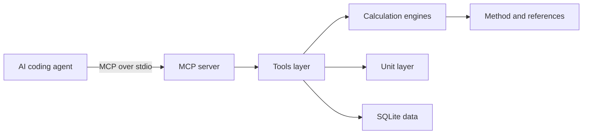

# Engineer MCP

[](https://github.com/DanielCuevas1208/engineer-mcp/actions/workflows/ci.yml)
[](LICENSE)
[](https://www.typescriptlang.org/)
[](package.json)

Engineer MCP is a Model Context Protocol server for mechanical-engineering calculations.
It gives coding agents verified answers for beams, bolts, springs, shafts, bearings, stress, sections, fits, and units.
Every result shows the formula, the method, and the source.

## What it provides

Use Engineer MCP inside an AI coding agent.
The agent calls a tool and receives a complete engineering answer.
The answer includes numbers, units, assumptions, and citations.

The release covers these domains:

- Beam bending stress and deflection.
- Bolt tensile design to ISO 898.
- Helical compression spring design.
- Shaft torsion and first critical speed.
- Bearing rating life to ISO 281.
- von Mises equivalent stress.
- Constant-amplitude fatigue assessment.
- Variable-amplitude fatigue damage assessment.
- Cross-section properties.
- Press and shrink fit analysis by Lamé theory.
- Dimension-safe unit conversion.
- Dynamic and kinematic viscosity conversion.
- Thermal conductivity conversion.
- Material property lookup.

## How results stay trustworthy

Each result carries its provenance.
The envelope lists the method, the formula, and the notes.
It also lists the cited standards and texts.

Units are checked at every step.
The unit layer knows the dimension of every unit.
It rejects a conversion between incompatible quantities.
For example, it rejects a torque-to-energy conversion.

Safety factors appear only when you provide the data they need.
The tool never hides an assumption.
Warnings surface when a method uses an approximation.

## Tools

| Tool | What it does |
| --- | --- |
| `beam_bending` | Bending stress, deflection, and safety factor. |
| `section_properties` | Area, inertia, and section modulus of a shape. |
| `bolt_strength` | Stress area, preload, and capacity of a bolt. |
| `interference_fit` | Interface pressure, hoop stresses, and friction capacity of a press or shrink fit. |
| `spring_design` | Spring rate, shear stress, and safety factor of a compression spring. |
| `shaft_analysis` | Torsion stress, twist, and critical speed. |
| `bearing_life` | ISO 281 rating life in revolutions and hours. |
| `von_mises` | Equivalent stress and yield safety factor. |
| `fatigue_analysis` | Fatigue safety factor by Goodman, Soderberg, or Gerber. |
| `fatigue_damage` | Miner damage from stress blocks and an ordered S-N curve. |
| `unit_convert` | Conversion between compatible units. |
| `material_lookup` | Curated mechanical properties of materials. |

See [docs/mcp-tools.md](docs/mcp-tools.md) for the full reference.
See [docs/units.md](docs/units.md) for the unit catalog.

## Architecture

Engineer MCP keeps the math separate from the server.
Pure engine functions take SI numbers and return plain objects.
The server layer adds unit conversion, material lookup, and provenance.
The database seeds from JSON files on first start.



Key directories:

| Path | Role |
| --- | --- |
| `src/engine/` | Pure calculation functions. |
| `src/units/` | Dimension-safe unit conversion. |
| `src/db/` | SQLite schema and seeding. |
| `src/handlers.ts` | Tool orchestration and result envelopes. |
| `data/` | Material, fastener, and reference data. |

## Quick start

1. Install Node.js 22.13 or newer.
2. Clone or copy this repository to your machine.
3. Run `npm install` to install dependencies.
4. Run `npm run build` to compile the server.
5. Run `npm run demo` to see the demo output.

The demo prints results for every tool.
It runs against an in-memory database.
It needs no API keys and no network access.

## Run as an MCP server

Run the server over standard input and output.

```sh
node dist/index.js
```

Add it to your MCP client configuration.
See [examples/mcp-config.example.json](examples/mcp-config.example.json) for a template.
Set `ENGINEER_MCP_DB` or pass `--db <path>` to choose the database file.
The default database file is `engineer-mcp.sqlite` in the working directory.

## Sample output

A call to `beam_bending` with a 20 kN point load on a 3 m S355 I-beam:

```text
Maximum bending moment                  15 kN·m
Maximum bending stress               25.36 MPa
Maximum deflection                  0.6039 mm
Bending safety factor                    14

Method: Euler-Bernoulli beam theory
Formula: simply supported, point: M = FL/4, delta = FL^3/(48EI)
References:
  - Roark's Formulas for Stress and Strain (Eighth edition, 2011)
  - Mechanics of Materials (Euler-Bernoulli beam theory)
```

A call to `spring_design` for a steel spring under 2 kN with squared and ground ends:

```text
Spring index                              5
Wahl factor                            1.31
Total coils                               6
Solid height                             48 mm
Spring rate                           158.6 N/mm
Deflection at load                    12.61 mm
Working length                        77.39 mm
Maximum shear stress                  521.4 MPa
Spring safety factor                  1.342

Method: Helical compression spring design
Formula: C = D/d, K_w = (4C-1)/(4C-4) + 0.615/C, tau = K_w 8FD/(pi d^3), k = G d^4/(8 D^3 Na), delta = F/k, Ls = d Nt
References:
  - Shigley's Mechanical Engineering Design (Tenth edition, 2015)
  - Machinery's Handbook (Thirty-first edition)
```

A call to `interference_fit` for a steel hub on a solid steel shaft with 50 µm of diametral interference:

```text
Interface pressure                    77.62 MPa
Hub tangential stress                 129.4 MPa
Shaft tangential stress               77.62 MPa
Axial force capacity                  73.16 kN
Torque capacity                       1.829 kN·m
Shaft safety factor                   3.865
Hub safety factor                     1.656
Torque safety factor                  1.829

Method: Interference fit by Lamé thick-cylinder theory
Formula: p = delta / (d K); K = (1/Eh)((Ro^2+r^2)/(Ro^2-r^2)+nu_h) + (1/Ei)((r^2+ri^2)/(r^2-ri^2)-nu_i); F = 2 pi r L p mu; T = F r
References:
  - Shigley's Mechanical Engineering Design (Tenth edition, 2015)
  - Machinery's Handbook (Thirty-first edition)
  - Theory of Elasticity (Lamé solution for thick-walled cylinders)
```

A call to `unit_convert` with a torque-to-energy request fails safely:

```text
Error: Category mismatch: N·m is torque, J is energy.
Use a unit of the same quantity.
```

A call to unit_convert with viscosity and thermal-conductivity values:

    1 Pa.s              -> 1000 cP
    1 W/cmK             -> 100 W/mK

The converter reports each quantity category and rejects incompatible dimensions.

A call to `fatigue_analysis` for a 42CrMo4 shaft with a 60 MPa cyclic stress about a 100 MPa mean:

```text
Stress ratio                           0.25
Maximum cycle stress                    160 MPa
Minimum cycle stress                     40 MPa
Mean stress                             100 MPa
Alternating stress                       60 MPa
Endurance limit                         500 MPa
Fatigue safety factor                 4.545
Yield safety factor                   4.375

Method: Constant-amplitude fatigue analysis
Formula: Goodman: 1/n = sa/Se + sm/Sut. Soderberg: 1/n = sa/Se + sm/Sy. Gerber: n sa/Se + (n sm/Sut)^2 = 1
References:
  - Shigley's Mechanical Engineering Design (Tenth edition, 2015)
```

A call to `fatigue_damage` for a repeating stress spectrum:

```text
Spectrum cycles                         110000
Finite-life blocks                            2
Cumulative Miner damage                  0.2676
Repeated-spectrum life                 411022
Maximum cycle stress                     450 MPa
Maximum corrected alternating stress     400 MPa
Governing damage block                         2
Governing fatigue safety factor          3.737

Method: Variable-amplitude fatigue damage analysis
Formula: Goodman: sa,c = sa/(1-sm/Sut). S-N: log(N) interpolated against log(sa). Miner: D = sum(ni/Ni)
References:
  - Shigley's Mechanical Engineering Design (Tenth edition, 2015)
```

## Development

| Command | Purpose |
| --- | --- |
| `npm run typecheck` | Run the TypeScript compiler. |
| `npm test` | Run the deterministic test suite. |
| `npm run build` | Emit `dist/` from `src/`. |
| `npm run demo` | Run the end-to-end demo. |
| `npm run dev` | Start the server from source. |

## Test status

The test suite is deterministic and offline.
It covers the engines, the unit layer, the database, and the tools.

- 150 tests across 13 files.
- The CI matrix checks Node 22 and Node 24.
- Typecheck and build pass locally.
- The CI workflow runs typecheck, tests, build, demo, and a package check.
- The CI workflow verifies that the CLI tool list pipes to standard output.

Run `npm test` to reproduce the results.

## Limitations

- The beam theory applies to small elastic deflections.
- The material table covers common engineering grades only.
- The bolt tables cover coarse metric threads from M5 to M36.
- The bearing factors are typical values for deep-groove ball bearings.
- The critical speed is a first-mode approximation.
- The spring design covers static round-wire springs only.
  It does not estimate fatigue life for cyclic loads.
- The `fatigue_analysis` tool covers constant-amplitude cycles only.
- The `fatigue_damage` tool uses supplied S-N points and linear Miner damage.
  It does not model load sequence, spectrum interaction, or crack growth.
- The press-fit theory assumes elastic material behavior and uniform friction.
  It does not model residual stress after yield.
- Viscosity and thermal-conductivity units are scalar conversions only.
  They do not model fluid flow or heat transfer.
- The built-in SQLite module of Node.js is still experimental.

Check the cited sources for exact values.

## Roadmap

The server grows in independent releases.
Each release stays useful on its own.

### Complete

- Viscosity and thermal-conductivity unit categories.
  The unit converter supports dynamic viscosity, kinematic viscosity, and thermal conductivity.
- Variable-amplitude fatigue damage assessment.
  The `fatigue_damage` tool reports block damage, cumulative damage, and repeated-spectrum life.
- Constant-amplitude fatigue assessment.
  The `fatigue_analysis` tool reports the stress ratio, the endurance limit, and the governing safety factor.
  It supports the modified Goodman, Soderberg, and Gerber criteria.
- Helical compression spring design.
  The `spring_design` tool reports the spring rate, the shear stress, and the safety factor.
- Press and shrink fit analysis.
  The `interference_fit` tool reports the interface pressure, the hoop stresses, and the friction capacity.

### Remaining

- Add HTTP transport.
- Add a catalog of ISO and DIN standard sections.

See [docs/integration.md](docs/integration.md) for the EngineerKit plan.

## EngineerKit

Engineer MCP is part of the EngineerKit family.
The family shares conventions for calculations, units, and provenance.
Other EngineerKit servers can import `@engineerkit/engineer-mcp/engine` and `@engineerkit/engineer-mcp/units`.
Read the boundary rules in [docs/integration.md](docs/integration.md).

## License

MIT. See [LICENSE](LICENSE).
